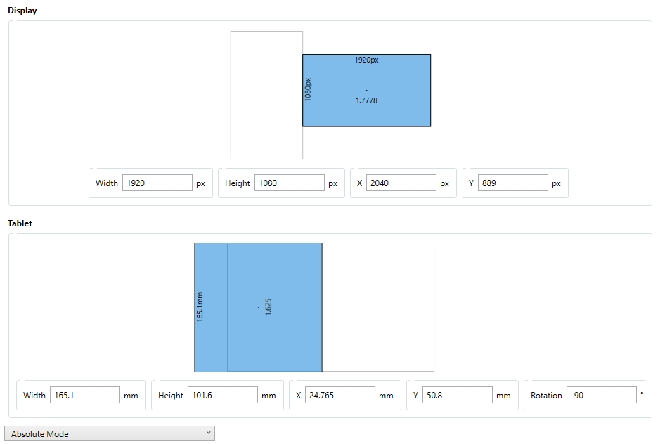

# MabletMapping Plugin

*Meant for [OpenTabletDriver](https://github.com/OpenTabletDriver/OpenTabletDriver)*

*Assuming you know what a mablet is of course.*

### The purpose:
A mapping tool for mablet players to better fit the arc of their wrist and replicate their old mouse settings.

### Setup and Values:

**OTD Area:**

Make sure to keep your area on Absolute Mode and only move and rotate, do not scale (scaling may affect follow radius shinanigans in filters used). 

Example Setup:

**Wirst Radius:**

    Default: 5.0
    The radius of your wrist in inches.
    Fine-tune this value so that making a sweeping horizontal motion with your wrist creates a straight line.
    u-Shape == radius set too low, increase value
    n-Shape == radius set too high, reduce value
    flat line == radius set perfectly

**Sensor Offset:** 

    Default: 0.0
    Offset from the would-be sensor to the pen tip in inches.
    Change this if you did not put the pen right above where the sensor should go.

**DPI:** 

    Default: 800
    DPI of your mouse.

**X/Y Ratio:** 

    Default: 1.0
    The aspect ratio of your DPI. 
    Higher means faster up-down movements.

**Sensitivity:** 

    Default: 1.0
    Multiplies the DPI value.
    Windows pointer speeds:
    0.03125 (1st tick)
    0.0625 (2nd tick)
    0.25 (3rd tick)
    0.5 (4th tick)
    0.75 (5th tick)
    1.0 (6th tick)
    1.5 (7th tick)
    2.0 (8th tick)
    2.5 (9th tick)
    3.0 (10th tick)
    3.5 (11th tick)
